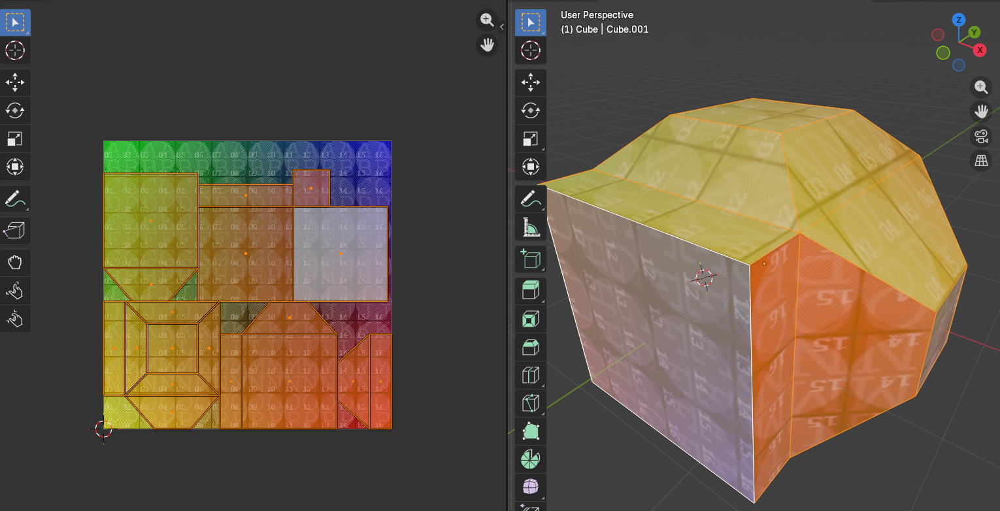
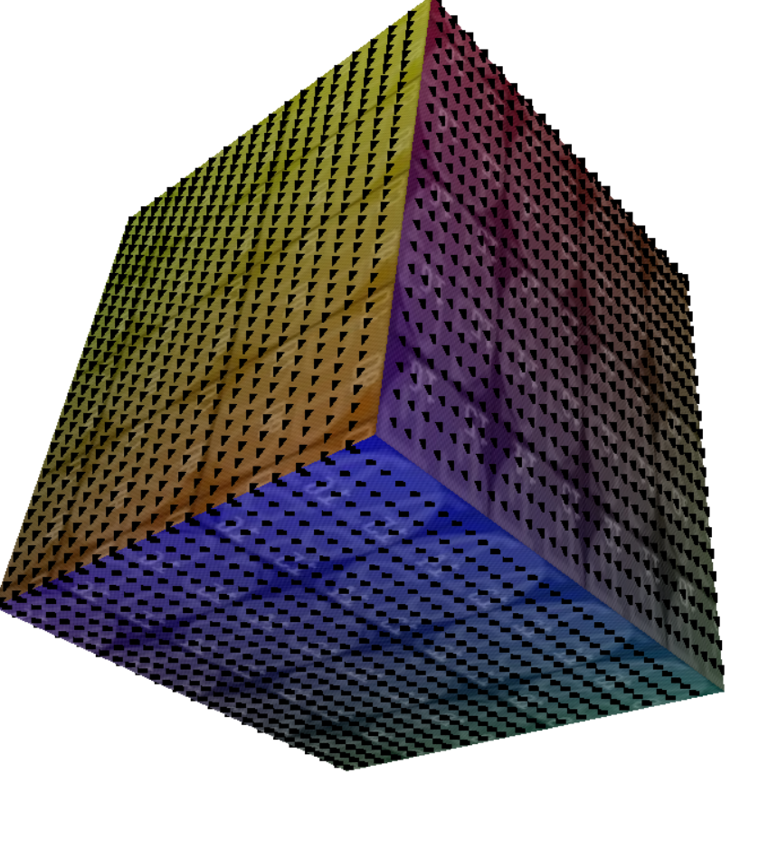
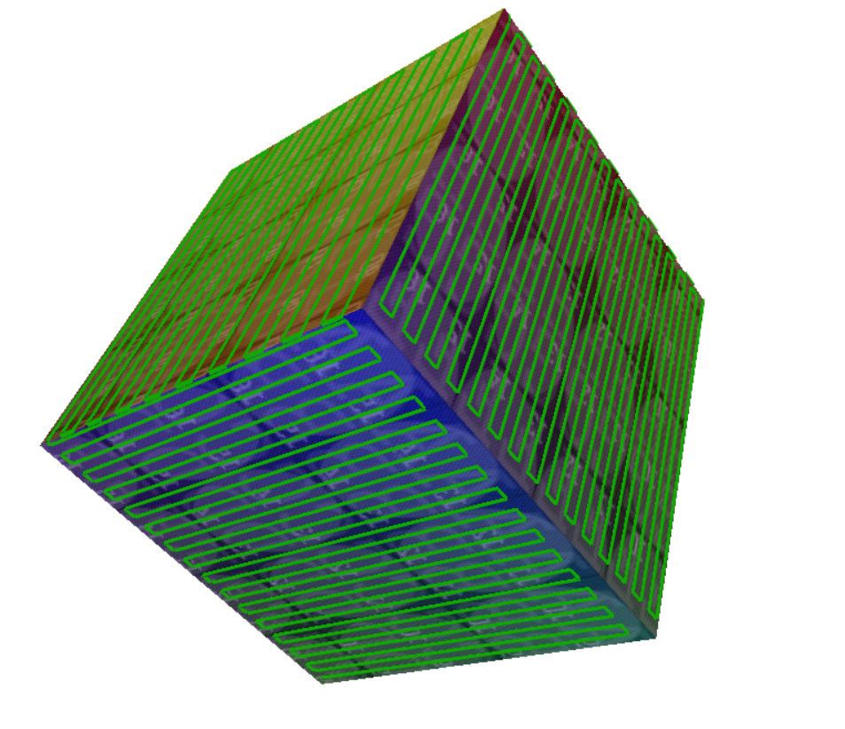

# Implementation algorithmique, par cartographie UV
Ce code est une tentative de solution au problème posé par AeroSpline.

## Principe de fonctionnement
Cette méthode déroule le maillage 3D en une carte UV, notament utiliser pour y appliquer une texture, dans le domaine du graphisme numérique. Le "unwrapping" comme est appelé ce processus, est déjà implément par *xatlas* et est compris dans la librairie *trimesh*. Il permet de "mettre à plat" le modèle 3D sur un plan 2D tout en conservant la taille des faces et des surfaces. 



Un quadriage de point est appliqué sur la carte UV. Ce quadriage est ensuite transposé sur le maillage 3D. Ce qui donne un nuage de point avec des point équi-distant entre eux (environ)



La prochaine étape consiste à créer un chemin passant par tout les points. Cette implémentation utilise un algorithme glouton. Pour une position du chemin donnée (un point dans le nuage de points), la prochaine position du chemin est déterminer comme:
- Un point qui n'a pas déjà été traversé par le chemin
- Le point maximisant le compromis :
  - Le point le plus proche par rapport à la distance euclidienne
  - Le point maximisant le produit scalaire entre sa normale et la normale du point actuel du chemin



## Limites
L'algorithme fonctionne au mieux sur les surface plannes. Les surfaces arrondis fonctionne assez mal, probablement dû au "unwrapping". La méthode implémenté par *xatlas* peut peut être améliorer.

La résolution du quadriallage sur la carte UV a une trés grande influence sur la qualité du résultat. Il doit être configuré (à taton) pour que les points du nuage de point soit espacé de au plus le rayon de l'effecteur du robot. Une haute résolution à tendance à réduire largement les performance dû à la complexité quadratique

## Mise en route
### Avec segmentation (Experimental)
```python ./main.py```
### Sans segmentation (Plus fiable mais plus lent)
```python ./uv_map.py```
## Dépendances
- Trimesh
- Xatlas
- Pillow
- Shapely
- Numpy